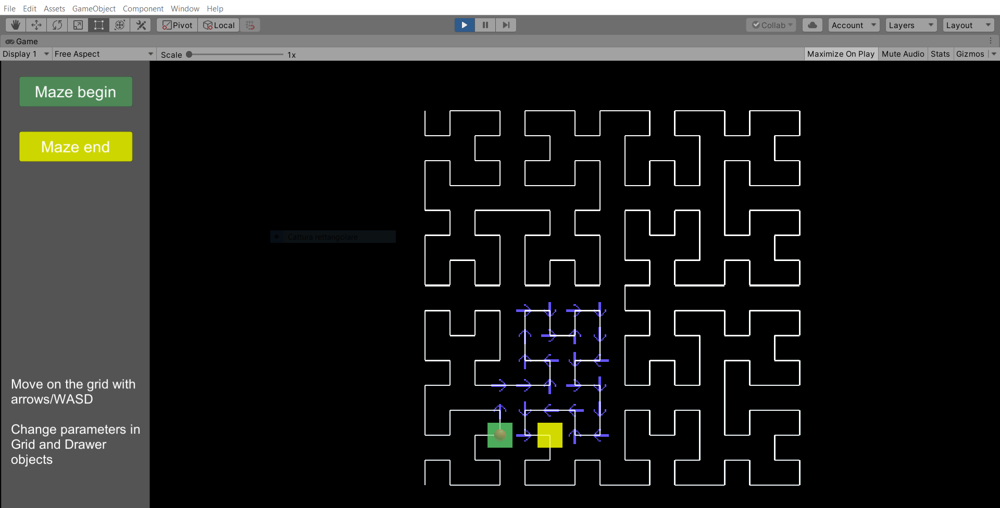
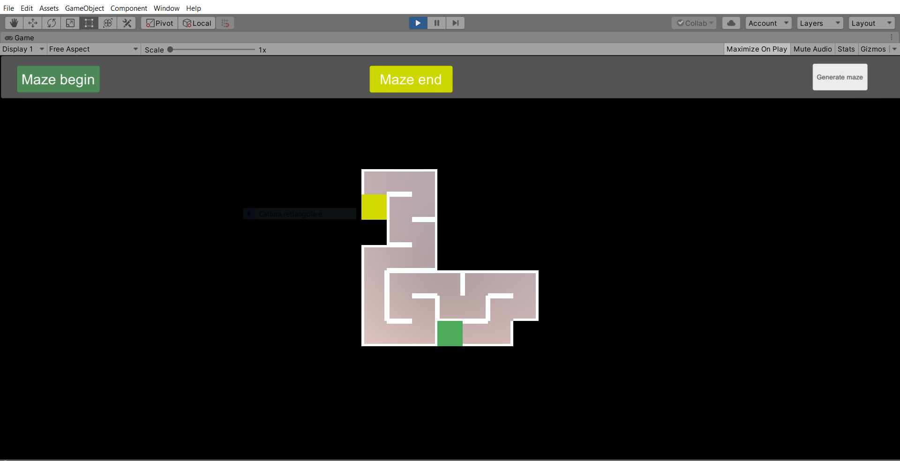

# ProceduralLevel_U3D
A little lab about the construction of procedural levels using Hilbert curve.
The project is composed of two scenes.

## Calculating grid

 

In this scene you can move around the red pointer on the Hilbert curve. The script will calculate the path using an intersection between the Hilbert curve and a plane of dimension **NxM** (N and M are represented by the rows and col variables of Grid script), activate Gizmos at runtime to spot this intersection.
Each path has a begin (green square) and an end (yellow square). You may notice that the red cursor to not always corresponds to the begin of the path. This is why the calculation is made by following the path of the entire curve, starting from the bottom left corner.

## Procedural level

 

In the scene is possible to generate random maze just by pressing the button.
You may play around with the variables of the LevelGenerator script.
